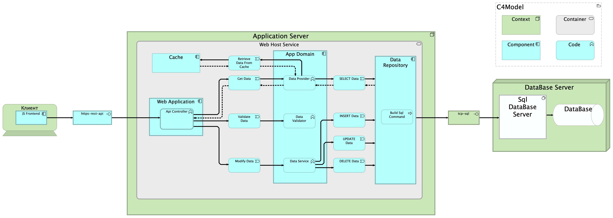

# WebTest C4Model Architecture
 
 
The diagram illustrates a layered client-server architecture for a web application. A JavaScript frontend communicates with the backend through a secure REST API over HTTPS. The backend is hosted on an Application Server and processes incoming HTTP requests using an API Controller, which acts as the main entry point to the system.
  
The core business logic is organized inside the App Domain layer. Data retrieval operations are handled by the Data Provider, while data modification operations are managed by the Data Service. Before any operation is executed, the Data Validator performs input and business validation to ensure data consistency and integrity.
  
The architecture also includes a caching layer to improve performance and reduce database load. When data is requested, the system first attempts to retrieve it from the cache before accessing the database.
  
Database interaction is encapsulated within the Data Repository layer, which is responsible for building and executing SQL commands. The system supports standard CRUD operations, including SELECT, INSERT, UPDATE, and DELETE. Communication with the SQL Database Server is performed through a TCP SQL connection.
  
Overall, the solution follows a layered enterprise architecture approach and applies common design patterns such as Repository and Service Layer, providing clear separation of concerns, maintainability, and scalability.
